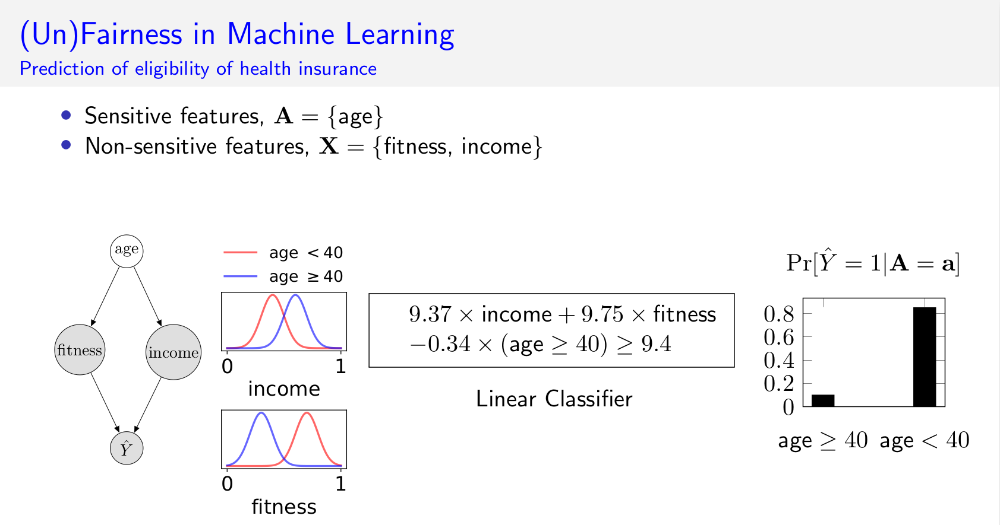

# Justicia
This is the implementation of our AAAI [2021](https://arxiv.org/pdf/2009.06516.pdf) and [2022](https://arxiv.org/pdf/2109.09447.pdf)  papers where we have proposed a formal approach to verify the fairness of machine learning classifiers.




## Documentation
Python tutorials are available in [doc](doc/).


## Install
- Install python dependencies (prerequisite)
`pip install -r requirements.txt`
- Install the python library
`pip install justicia`

### Other dependencies
- [PGMPY](https://github.com/pgmpy/pgmpy)
- [SSAT solver](https://github.com/nianzelee/ssatABC). Checkout to the compatible version.
    
    ```
    git clone https://github.com/NTU-ALComLab/ssatABC.git
    cd ssatABC
    git checkout 91a93a57c08812e3fe24aabd71219b744d2355ad
    ```
- [PySAT](https://github.com/pysathq/pysat)


## Citations
Please cite following papers.
```
@inproceedings{ghosh2022algorithmic,
author={Ghosh, Bishwamittra and Basu, Debabrota and Meel, Kuldeep S.},
title={Algorithmic Fairness Verification with Graphical Models},
booktitle={Proceedings of AAAI},
month={2},
year={2022},
}

@inproceedings{ghosh2021justicia,
author={Ghosh, Bishwamittra and Basu, Debabrota and Meel, Kuldeep S.},
title={Justicia: A Stochastic {SAT} Approach to Formally Verify Fairness},
booktitle={Proceedings of AAAI},
month={2},
year={2021},
}
```
## Contact
[Bishwamittra Ghosh](https://bishwamittra.github.io/) (bghosh@u.nus.edu)

### Issues, questions, bugs, etc.
Please click on "issues" at the top and [create a new issue](https://github.com/meelgroup/justicia/issues). All issues are responded to promptly.
